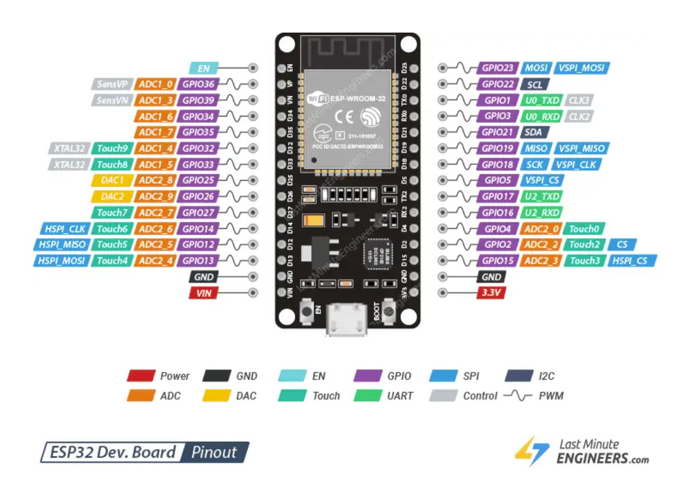
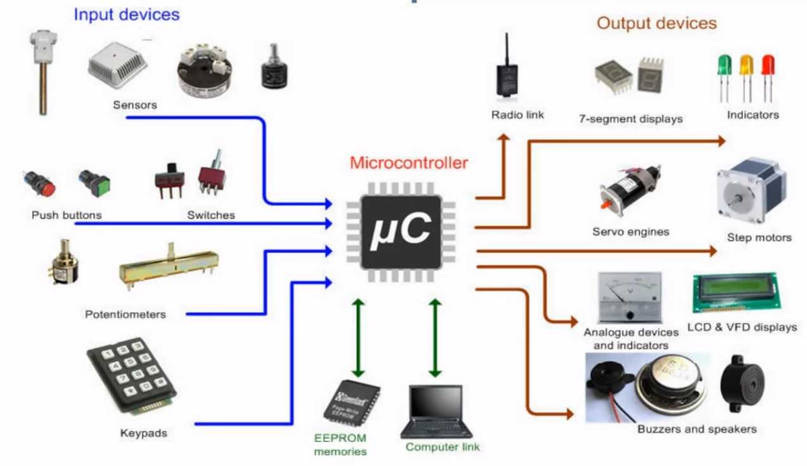

# Microcontroller Basics

## ESP32 
### Overview  

The ESP32 is a **microcontroller**. A microcontroller a small programmable 
computer chip which interacts with the outside world through a set of input 
and output pins. All a microcontroller does is take some inputs, performs 
some processing, and controls some outputs.  

The seemingly simple capabilities of a microcontroller in fact enable it to 
perform a wide range of functions. You can find microcontrollers in 
everything around you, from headphones, to satellites, to cars to 
3d-printers. The very same ESP32 chip we're going to be using is very popular 
in smart devices, so if you have wifi-controlled lights, or a thermostat 
you can adjust from your phone, you may already have an ESP32 in your home. 



In all of these devices, the fundamental working principle is the same. 
Get data from input pins. Perform some processing. Control the output pins. 

For our project, the input is going to be a microphone, and the output is 
going to be an RGB LED grid. But there are many other options to choose 
from.   
  
#### Inputs and outputs


  
## Setup

1. Download the Arduino IDE [here](https://www.arduino.cc/en/software/)
2. Follow these [instructions](https://docs.espressif.com/projects/arduino-esp32/en/latest/installing.html) 
to set up your ESP32 board. 
  
## Programming your microcontroller 
### Blinky 
When getting started with a new devboard, microcontroller, or project, you're 
almost always going to want to write a blinky program. This is a simple way 
to make sure that your board works, that you know how to upload code to your
board, and that you can use its basic features. 

For us, this will also be a great opportunity to learn about some fundamental 
programming concepts.  

```
// Blinky example 

int LED = 2; 

// Runs once when ESP32 is powered on 
void setup() {
  // Set pin mode
  pinMode(LED,OUTPUT);
}

// Runs in a continuous loop after setup()
void loop() {
  delay(500); // Delays for 500 milliseconds (1/2 second)
  digitalWrite(LED, HIGH);
  delay(500);
  digitalWrite(LED, LOW);
}

```
### Hello world  
Another common test program is the hello world. In fact, when learning a 
new programming language, you're going to write a hello world program
before anything else. 

```
void setup() {
  // Create a serial connection
  // This will enable us to send data 
  // From our microcontroller to our 
  // computer one bit at a time. 
  // 115200 is the speed at which we can
  // send data. This is called the baud 
  // rate and it is measured in bits per
  // second. 
  Serial.begin(115200); 
}

void loop() {
  // Send a string of characters to 
  // our computer. 
  Serial.println("Hello World"); 
  delay(3000); 
}

```
After you upload your code to your microcontroller, go to 

### Programing basics: What is code?  
  
The snippet shown above is an example of C++ code. But what you see above 
is not actually what is uploaded to our ESP32. 

### Building blocks of a program
 
#### Variables
Variables are the way we store information in a program. There are few 
different variable types in C++, which are defined by specific keywords.  

Here are some of the more common types we will encounter in this class. 
  
- <span style="color:teal">int</span>: 
stores whole numbers, typically between -2,147,483,648 to 2,147,483,647
- <span style="color:teal">float</span>: 
stores decimal values, between -3.4^38 to -3.4^38. 
- <span style="color:teal">bool</span>: 
represents either true or false, (1 or 0). bool stands for boolean
  
```
int a = 3; 
int b = 2; 
int c = a + b;  // c is now equal to 5

bool d = false; 
bool c = true; 
```


## Soldering

##  