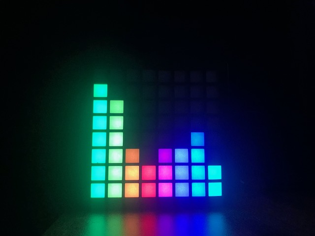

# Set Columns 
In our music visualizer, each column of our LED grid is going to represent 
the how much a particular frequency range is in our audio signal.



**Excercise: Write a function to set the height of each column.**

### Template
```c++
// We must include the Adafruit NeoPixel library
#include <Adafruit_NeoPixel.h>

// Variables describing the LED grid 
int PIXEL_COLS_VISIBLE = 8;
int PIXEL_COLS_HIDDEN = 9; 
int PIXEL_COLS_TOTAL = PIXEL_COLS_VISIBLE + PIXEL_COLS_HIDDEN;
int PIXEL_ROWS = 8;
int PIXEL_COUNT = PIXEL_ROWS * PIXEL_COLS_TOTAL; 
int PIXEL_PIN = 13; 

// initialize our neopixels
Adafruit_NeoPixel pixels(PIXEL_COUNT, PIXEL_PIN, NEO_GRB + NEO_KHZ800);

void setGridPixel(int row, int col, int color) {
    /*
    * Write a function that takes in a row and column, then sets the 
    * corresponding pixel.
    */
}

void setGridColumn(int col, int height, int color) {
    /*
    * Write a function that takes in a column number and height, then sets the 
    * corresponding pixels.
    */
}

void setup() {
    // Set the brightness. 
    // We can set the maximum brightness of our LEDs. 
    // We only need to set this once
    pixels.setBrightness(15);

    // Initialize the pixels. Only needs to be done once
    pixels.begin();
}

void loop() {
    int red = 255;
    int blue = 0; 
    int green = 0;

    int color = pixels.Color(red, green, blue);
    int height = 0;
    // Our pixels are RGB. We can set the value of each LED in the pixels. 
    // The combination will determine the color. 
    for(int col = 0; col < PIXEL_COLS_VISIBLE; col++) {
        height = col + 1;
        setGridColumn(col, height, color);
    }
    pixels.show();
    delay(1000);
    for(int col = 0; col < PIXEL_COLS_VISIBLE; col++) {
        height = PIXEL_COLS_VISIBLE - col;
        setGridColumn(col, height, color);
    }
    pixels.show();
    delay(1000);

}
```

### Tips
1. Use setGridPixel() function that you wrote in the previous excercise.
2. Remember for each column that you must clear the unused pixels. 
3. Setting the pixel colors to all zero will turn off the pixel.
4. Think about how you can use a for loop to loop over all the pixels in a column.

