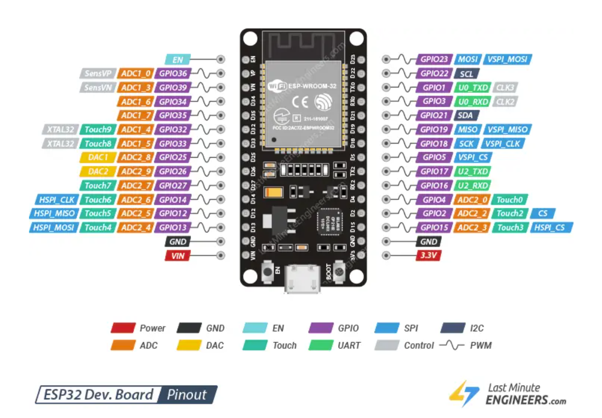

# Microcontroller Basics

## ESP32 
### Overview  

The ESP32 is a **microcontroller**. A microcontroller a small programmable 
computer chip which interacts with the outside world through a set of input 
and output pins. All a microcontroller does is take some inputs, performs 
some processing, and controls some outputs.  

The seemingly simple capabilities of a microcontroller in fact enable it to 
perform a wide range of functions. You can find microcontrollers in 
everything around you, from headphones, to satellites, to cars to 
3d-printers. The very same ESP32 chip we're going to be using is very popular 
in smart devices, so if you have wifi-controlled lights, or a thermostat 
you can adjust from your phone, you may already have an ESP32 in your home. 



In all of these devices, the fundamental working principle is the same. 
Get data from input pins. Perform some processing. Control the output pins. 

For our project, the input is going to be a microphone, and the output is 
going to be an RGB LED grid. But there are many other options to choose 
from.   
  
#### Inputs and outputs


## Programming your microcontroller 
### Blinky 
When getting started with a new devboard, microcontroller, or project, you're 
almost always going to want to write a blinky program. This is a simple way 
to make sure that your board works, that you know how to upload code to your
board, and that you can use its basic features. 

For us, this will also be a great opportunity to learn about some fundamental 
programming concepts.  

```
// Blinky example 

int LED = 2; 

// Runs once when ESP32 is powered on 
void setup() {
  // Set pin mode
  pinMode(LED,OUTPUT);
}

// Runs in a continuous loop after setup()
void loop() {
  delay(500); // Delays for 500 milliseconds (1/2 second)
  digitalWrite(LED, HIGH);
  delay(500);
  digitalWrite(LED, LOW);
}

```
### Building blocks of a program
 


**Variables:** 

### Hello world

## Soldering

##  